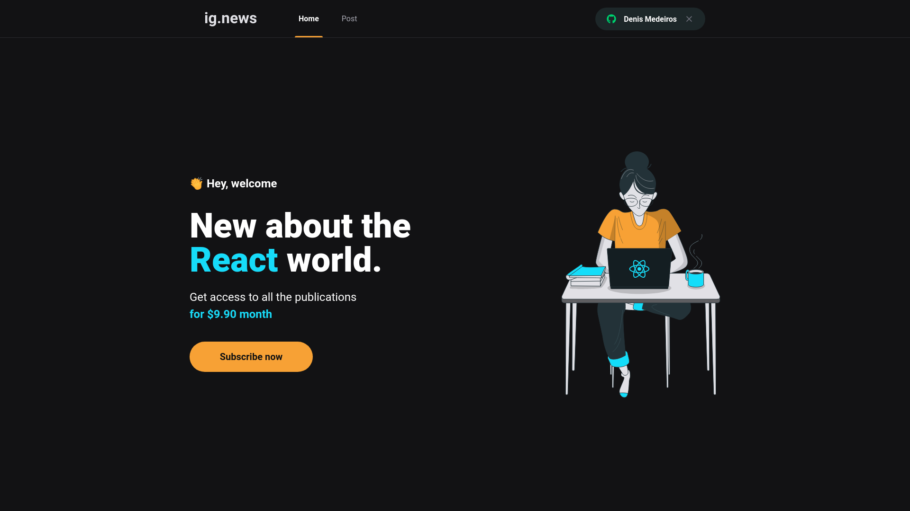

# 📰 Ig.News



Esse projeto de estudo para a criação de um blog de noticias. Conta com autenticação OAuth com Github via Next-Auth, pagamento via Stripe com cartão de credito, gerenciamento de conteudo com PrismicCMS e todas informações necessarias salvas no FaunaDB, interface construida com NextJs + Sass.

### 🔧 Tecnologias

- [NextJS](https://nextjs.org/)
- [PrismicCMS](https://prismic.io/)
- [Stripe](https://stripe.com/en-br)
- [Next Auth](https://next-auth.js.org/)
- [FaunaDB](https://fauna.com/)
- [Sass](https://sass-lang.com/)

### 🔨 Execução

```bash
$ git clone https://github.com/DenisMedeirosSDK/ignews.git

$ npm install
```

- Copie e cole no terminal `touch .env.local` para criar o arquivo.

- Crie um novo arquivo na raiz `.env.local` e copie as informações de `.env.example` para dentro dele.

- Preencha as informações necessarias.

- Para preencher o **STRIPE_WEBHOOK_SECRET** no arquivo `.env.local` pegue o token que sera gerado nos proximos passos dentro do terminal.

- Para escutar os Webhooks do stripe localmente instale a [StripeCLI](https://stripe.com/docs/stripe-cli), e execute o comando em outro terminal:

```bash
$ stripe listen --forward-to localhost:3000/api/webhooks
```

_OBS: agora já é possivel pegar o token de webhook que foi gerado no terminal._

Inicialize a aplicação com: `npm run dev`

Acesse em : http://localhost:3000/
